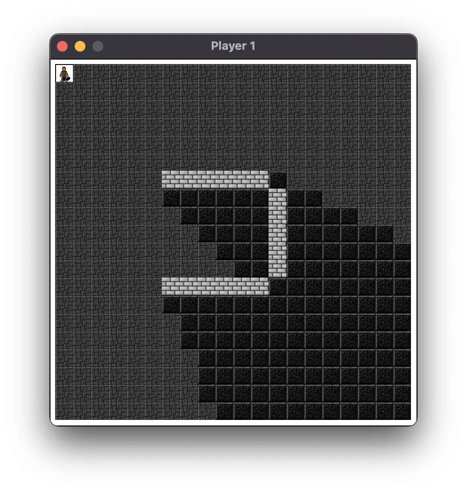
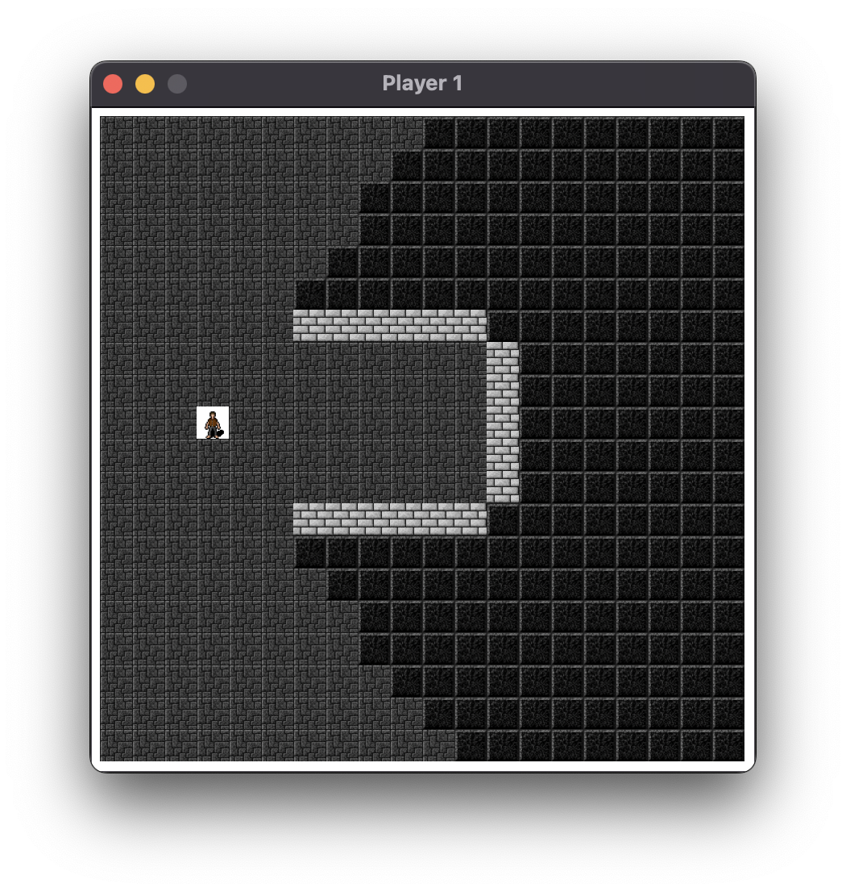
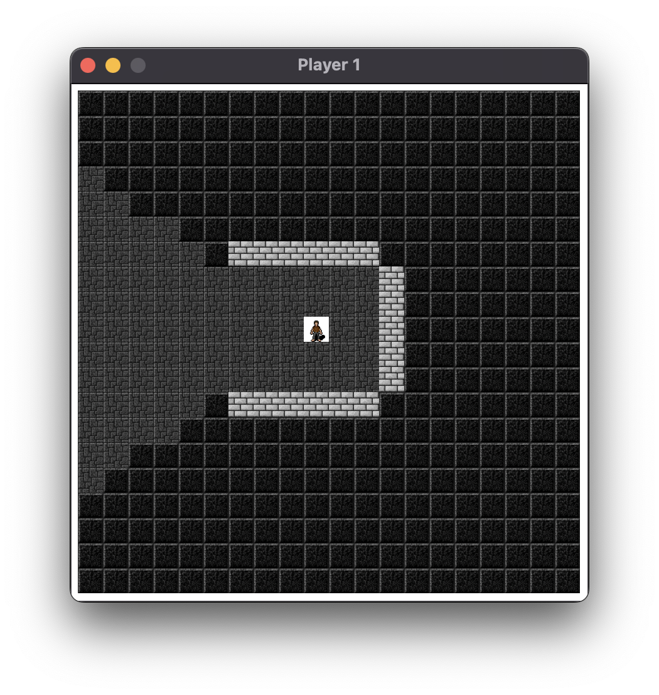
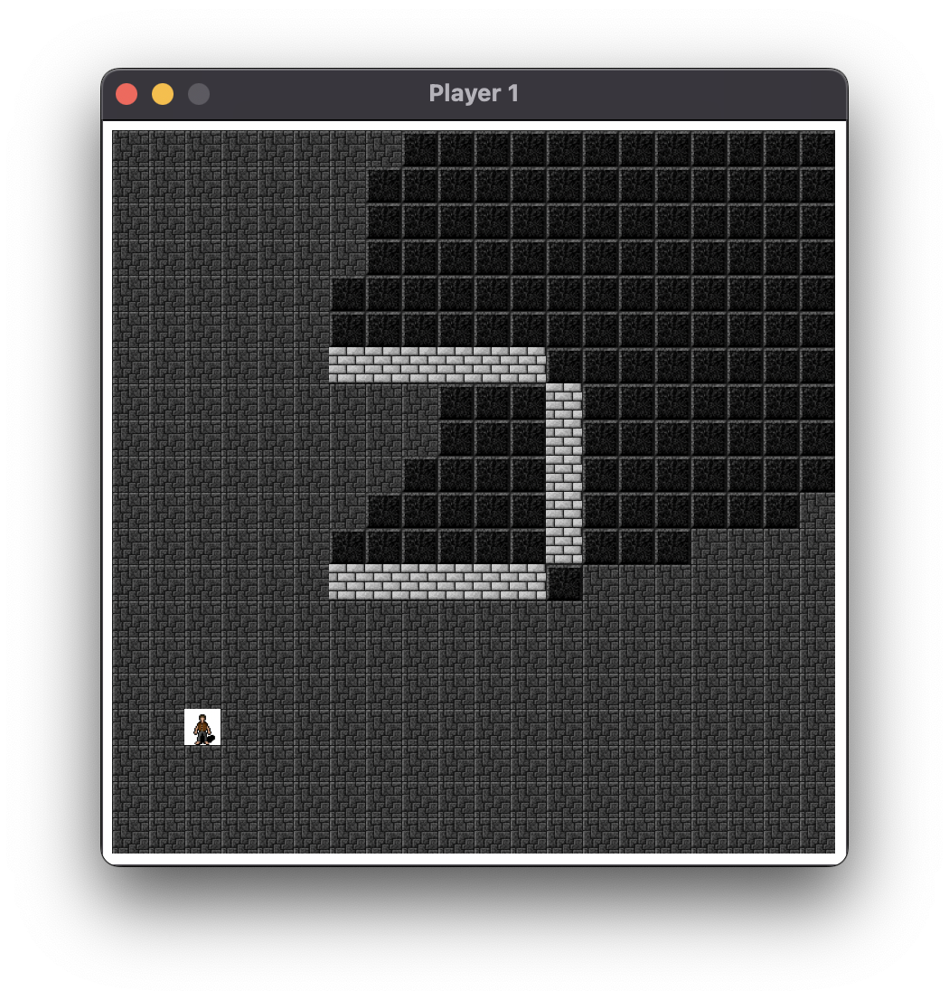
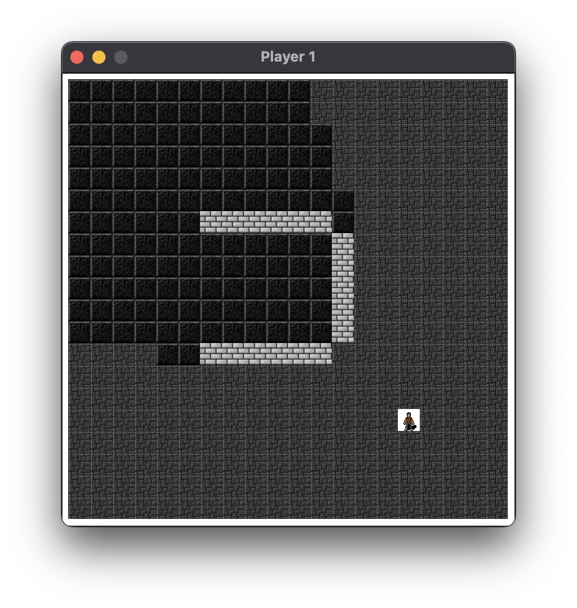

# Racket path intersection demo
Run with

```sh
racket server.rkt & racket client.rkt ; fg
```

or any other method to execute server.rkt and client.rkt afterwards. Note though
that both have to run at the same time.





